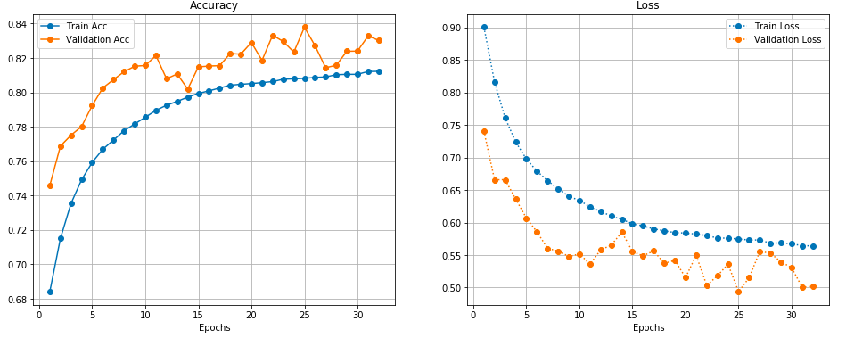
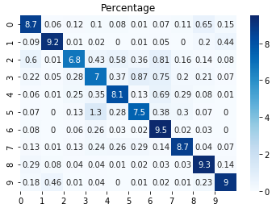

# MSA Phase2 Accessment
Microsoft Student Accelerate Program (NZMSA)

### keras_cifar10.ipynb
I built a CNN model with **4 stacked Conv2D layer** and trained it one Google Colab with one free GPU.
keras_cifar10.ipynb contains the code, and results in CNN_Results folder

1. CNN structure is based on the example code from Keras, refer to
https://github.com/keras-team/keras/blob/master/examples/cifar10_cnn.py

2. I made the code to 
- use keras callbacks,  save the mode in json, weights in hdf5 and training acc/loss in csv
- plot the training/validation acc/loss via epochs
- the classification report: precision, recall, f1, support score
- plot the confusion matrix

3. The result:
- 4 Conv2D layers, stacked, 100 epochs: score 78
- 4 Conv2D layers, stacked, data augment, 32 epochs: score 84

### Train_Scratch_ResNet50.ipynb
**Train the ResNet50 from scratch on CIFAR10 Images**
- All layer2 in ResNet50 is trainable
- UpSampling2D() for input
- BatchNormalization() in full connected layers  
After 5 epoch, the train_acc=0.8745, val_acc=0.9328, **test_acc (score)=0.933**
  
- refer to https://medium.com/@andrew.dabydeen/transfer-learning-using-resnet50-and-cifar-10-6242ed4b4245
- refer to https://github.com/frlim/data2040_final/blob/master/project_2/CNN_Final.ipynb

### TL_CIFAR10_VGG16.ipynb
**Transfer Learning CIFAR10 on VGG16 model**
- set trainable on block4_conv1 and block5_conv1
- use data augmentation
- after 10 epochs, acc=0.8687, val_acc=0.8005, score(test_acc)=0.5494  
(Should Try resize input size from 32 to 224) 
  
refer to https://towardsdatascience.com/a-comprehensive-hands-on-guide-to-transfer-learning-with-real-world-applications-in-deep-learning-212bf3b2f27a
